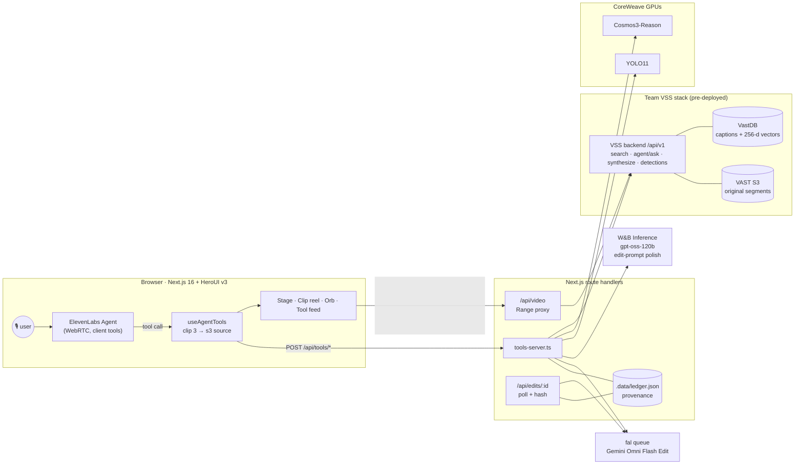

# Accident Scrubber

**Talk to your footage.** A voice agent wired into a live video archive. Ask for any moment in
plain speech and it finds the clip across every camera. Tell it to change the clip and it re-renders
it with a generative video model. Ask whether a clip is real and it proves what happened, using the
untouched original stored in VAST.

> *Find any moment. Rewrite it with one sentence. Prove what really happened.*

Built in one day at the **VAST Builders Challenge** (SF, Oct 2 2026) on VAST + NVIDIA Cosmos + YOLO11
+ W&B Inference, with **ElevenLabs Agents** for voice and **fal** for video editing.

---

## What it does

| | You say | What happens |
|---|---|---|
| **Find** | “Find a truck changing lanes on the highway.” | Hybrid text + visual search (Cosmos Embed) over every indexed camera on VAST. Numbered clips fly into the reel and the best one plays. |
| **Understand** | “What colour is the car in clip three?” | NVIDIA **Cosmos3-Reason** watches the actual segment and answers. YOLO11 counts objects. The VSS agent answers archive-wide questions. |
| **Rewrite** | “Edit clip one: remove the truck.” | W&B Inference (gpt-oss-120b) turns the request into a precise edit instruction. The segment goes to **fal** (Gemini Omni Flash 1.1 Edit by default) and comes back as an AI-EDITED copy beside the original. |
| **Prove** | “Is that clip real?” | The authenticity check compares SHA-256 fingerprints of the original in VAST and the edit, has Cosmos describe both, and reports **exactly what was changed**. |

The point of the demo: **generative video editing is now one sentence away, and that's both
useful and dangerous.** An archive that can be searched and edited also has to be able to prove what
the original showed. Originals are never modified. Every edit is a labelled copy recorded in a
provenance ledger.

---

## Architecture



More detail, including sequence diagrams for find, edit and prove: [docs/ARCHITECTURE.md](docs/ARCHITECTURE.md).

### How each piece of the stack is used

| Component | Role in Accident Scrubber |
|---|---|
| **VAST S3 + VastDB** | Holds the original ~5 s segments, their Cosmos captions and embeddings. It's the source of truth the authenticity check hashes against. |
| **VSS backend** | `POST /search` (hybrid search + LLM synthesis), `POST /agent/ask`, `POST /videos/synthesize`, `GET /videos/detections`, `GET /videos/stream` |
| **NVIDIA Cosmos Embed1** | Powers the hybrid text/visual search behind every "find" request |
| **NVIDIA Cosmos3-Reason** | Ingest captions, plus live "look closer" questions and the forensic descriptions of original vs edit |
| **YOLO11** | Object counts per clip (pipeline sidecar, live fallback) |
| **W&B Inference** (CoreWeave) | Rewrites spoken edit requests into precise, preservation-aware instructions |
| **ElevenLabs Agents** | Speech-to-speech agent with 10 client tools, WebRTC, low latency |
| **fal** | Queue-based video-to-video editing (`FAL_EDIT_MODEL`, Gemini Omni Flash 1.1 Edit by default) |
| **Cursor** | Used to build and run everything on the workshop VM |

### The agent's tools

Defined in [agent/tools.json](agent/tools.json), handled in [components/useAgentTools.ts](components/useAgentTools.ts),
executed in [lib/tools-server.ts](lib/tools-server.ts).

| Tool | Backed by | Notes |
|---|---|---|
| `search_archive` | VSS `/search` | Optional `camera_id` / `location` filters. Best hit auto-plays. |
| `ask_archive` | VSS `/agent/ask` | Optionally scoped to one clip's parent video |
| `list_cameras` | VSS `/metadata/schema` | Lets the agent pick valid filters |
| `show_clip` | UI only | Clip or edit (before/after) on the main screen |
| `look_closer` | Cosmos3-Reason | Watches the real mp4 (4 fps) |
| `detect_objects` | YOLO11 | Max count per class per frame |
| `summarize_video` | VSS `/videos/synthesize` | Timeline of the parent video |
| `edit_clip` | W&B → fal | Returns immediately; a background poll notifies the agent when the render is ready |
| `check_edit` | ledger | Status of a render |
| `verify_clip` | ledger + Cosmos3-Reason | Verdict, fingerprints, what Cosmos sees in each version |

---

## Run it on the VAST workshop VM

The VSS, GPU and W&B variables are already exported on the VM from `/config/<team>.config`.
You only add two keys.

```bash
# 0. Node 20.9+ (check; install with nvm if missing)
node -v || (curl -fsSL https://raw.githubusercontent.com/nvm-sh/nvm/v0.40.3/install.sh | bash && . ~/.nvm/nvm.sh && nvm install 22)

# 1. Get the code
git clone https://github.com/Gabrielebattimelli/Accident-Scrubber.git && cd Accident-Scrubber
npm ci

# 2. Keys (never commit .env.local)
cp .env.example .env.local
#    → fill ELEVENLABS_API_KEY and FAL_KEY

# 3. Create the ElevenLabs agent + its 10 client tools (idempotent; re-run after editing agent/*)
npm run agent:setup
#    → paste the printed ELEVENLABS_AGENT_ID=... into .env.local

# 4. Run
npm run build && npm start        # or: npm run dev
```

Then check the wiring before you talk to it:

```bash
curl -s localhost:3000/api/health          # every line should say ok / configured
curl -s "localhost:3000/api/debug?q=truck" # raw VSS search + how it was normalised
```

If a VM variable is missing from your shell: `set -a; source /config/*.config; set +a`.

### Microphone (read this first)

Browsers only allow the mic on **https** or **localhost**. Pick one:

1. **VM browser:** open `http://localhost:3000` inside the VM desktop, if it forwards your laptop's mic.
2. **HTTPS tunnel to your laptop (most reliable):** run one of these on the VM and open the printed `https://` URL on your laptop.
   ```bash
   ssh -R 80:localhost:3000 nokey@localhost.run
   # or
   npx cloudflared tunnel --url http://localhost:3000
   ```
3. **Team ingress at `/app`:** see the deploy section. It's served over http, so in Chrome on your laptop enable
   `chrome://flags/#unsafely-treat-insecure-origin-as-secure` for `http://video-lab-team-<N>.cosmos.vastdata.com`.

No mic at all? Type into the box under the orb. Typed messages go to the same agent.

### Deploy to the team host at `/app`

```bash
ELEVENLABS_API_KEY=... ELEVENLABS_AGENT_ID=... FAL_KEY=... ./deploy/k8s.sh
kubectl -n "$USERNAME" logs -f deploy/accident-scrubber   # builds in the pod, 2–4 min
```

This follows the `deploy-app-no-registry` skill: there's no Docker build. The source ships in a ConfigMap and is built
inside `node:22-slim` with `NEXT_PUBLIC_BASE_PATH=/app`.

---

## Configuration

See [.env.example](.env.example).

| Variable | Default | Purpose |
|---|---|---|
| `VSS_URL` / `INGRESS_URL` | from VM | VSS backend base URL |
| `VSS_USERNAME` / `USERNAME`, `VSS_PASSWORD` / `PASSWORD` | from VM | VSS login |
| `COSMOS3_REASON_URL`, `GPU_BEARER_TOKEN`, `YOLO_URL` | from VM | Direct GPU endpoints |
| `WANDB_API_KEY`, `WANDB_TEAM`, `WANDB_PROJECT` | from VM | Edit-prompt polishing (optional) |
| `ELEVENLABS_API_KEY`, `ELEVENLABS_AGENT_ID` | **add** | Voice agent |
| `ELEVENLABS_LLM`, `ELEVENLABS_VOICE_ID` | `gemini-2.5-flash`, `JBFqnCBsd6RMkjVDRZzb` | Used by `agent:setup` |
| `NEXT_PUBLIC_VOICE_TRANSPORT` | `webrtc` | `websocket` if WebRTC is blocked on the network |
| `FAL_KEY` | **add** | Video editing |
| `FAL_EDIT_MODEL` | `google/gemini-omni-flash/v1.1/edit` | Any fal endpoint taking `{prompt, video_url}` |
| `FAL_EDIT_RESOLUTION` | `720p` | Gemini Omni: `360p` / `720p` / `1080p` / `4k` |
| `FAL_EDIT_EXTRA_JSON` | none | Extra JSON merged into the fal input |

---

## Troubleshooting

| Symptom | Fix |
|---|---|
| “Microphone unavailable” | Not a secure context. Use localhost or a tunnel (see Microphone). |
| Agent talks but never calls tools | Re-run `npm run agent:setup`, and check that the agent ID in `.env.local` is the one it printed |
| `TOOL ERROR: VSS login failed (401)` | VM variables aren't in this shell: `set -a; source /config/*.config; set +a` |
| Search finds clips but they have no camera or caption | Open `/api/debug?q=...` and match field names in [lib/clips.ts](lib/clips.ts) |
| Clips don't play | Open `/api/video?source=<s3 uri>` directly; check the VSS token and segment URI |
| Edit stuck on “rendering” | `curl localhost:3000/api/edits/e1`. fal queue position is in the response. Try `FAL_EDIT_RESOLUTION=360p` for speed. |
| WebRTC won't connect on venue Wi-Fi | `NEXT_PUBLIC_VOICE_TRANSPORT=websocket`, rebuild |

---

## Responsible by design

- **Originals are read-only.** The app never writes to the archive. Edits are new files on fal's CDN.
- **Every edit is labelled.** AI-EDITED stamp on screen, edit IDs in speech, and a ledger entry with
  SHA-256 of the original and the output, the user's words, the exact prompt sent, and the model.
- **The agent won't pass an edit off as original.** That's a hard rule in [agent/prompt.md](agent/prompt.md),
  and `verify_clip` is one sentence away for anyone who asks.
- **Footage:** only the challenge's provided, licensed corpus is used. Generated clips are never ingested back into VSS.

---

## Repo layout

```
agent/            ElevenLabs agent: prompt.md + tools.json (source of truth for agent:setup)
app/api/          tools/[name] · video · edits/[id] · voice/token · health · debug
components/       Studio (hero → console), Stage, ClipReel, ActivityFeed, Orb, useAgentTools, store
lib/              env, vss, clips, cosmos, detections, edit (fal), polish (W&B), ledger, types
scripts/          setup-agent.mjs: upserts tools + agent through the ElevenLabs API
deploy/k8s.sh     no-registry deploy to /app on the team host
docs/             ARCHITECTURE.md · DEMO.md · SHORT_FILM.md
```

## Docs

- [docs/ARCHITECTURE.md](docs/ARCHITECTURE.md): sequence diagrams, data shapes, design decisions
- [docs/DEMO.md](docs/DEMO.md): the 2-minute live demo, word for word, plus judge Q&A
- [docs/SHORT_FILM.md](docs/SHORT_FILM.md): *SCRUBBED*, the Higgsfield short film script and shot list
