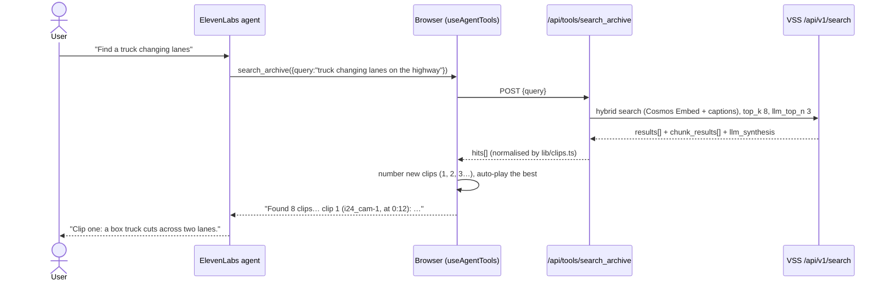

# Architecture

Raccoon is a single Next.js 16 app. The browser runs the voice session; the server runs the
tools. ElevenLabs never talks to our backend directly. Every tool is a **client tool**: the agent asks
the browser, the browser asks our API. That keeps every credential server-side and lets each tool call
update the screen the moment it returns.

## 1. Find



**Why numbered clips:** voice is bad at UUIDs and S3 paths. Each new segment gets the next small integer
for the whole session, so "edit clip three" means the same clip ten minutes later. The handler resolves
`"3"`, `"c3"` or `"clip 3"`. If the agent omits `clip_id`, it uses the clip on screen.

## 2. Rewrite (async edit)

```mermaid
sequenceDiagram
  actor U as User
  participant EL as ElevenLabs agent
  participant B as Browser
  participant API as /api/tools/edit_clip
  participant WB as W&B Inference
  participant FAL as fal queue
  participant L as ledger
  U->>EL: "Edit clip one: remove the truck"
  EL->>B: edit_clip({clip_id:"1", instruction})
  B->>API: POST {source, instruction, caption}
  API->>API: download segment from VSS, sha256(original)
  par
    API->>FAL: storage.upload(mp4) → video_url
  and
    API->>WB: polish instruction (8 s timeout, falls back to raw words)
  end
  API->>FAL: queue.submit(FAL_EDIT_MODEL, {prompt, video_url, resolution})
  API->>L: record e1 {originalSha256, instruction, prompt, model, requestId}
  API-->>B: {edit: e1, status: queued}
  B-->>EL: "Edit e1 is rendering… a [system notice] will arrive"
  EL-->>U: "Rendering now, about a minute."
  loop every 4 s
    B->>FAL: GET /api/edits/e1 → queue.status
  end
  FAL-->>B: COMPLETED → result.video.url (server hashes it into the ledger)
  B->>B: show original | AI-EDITED side by side
  B->>EL: sendUserMessage("[system notice] Edit e1 is ready…")
  EL-->>U: "Done. The truck is gone; original on the left."
```

**Why async:** renders take 30–90 s, longer than a voice turn should block. The tool returns at once, the
conversation keeps going, and the browser pushes a hidden `[system notice]` into the conversation when
the render lands. The UI filters these out of the transcript.

## 3. Prove

```mermaid
sequenceDiagram
  actor U as User
  participant EL as ElevenLabs agent
  participant B as Browser
  participant API as /api/tools/verify_clip
  participant VAST as VSS / VAST S3
  participant C as Cosmos3-Reason
  U->>EL: "Is that clip real?"
  EL->>B: verify_clip({edit_id:"e1"})
  B->>API: POST {edit_id}
  API->>VAST: fetch original segment
  API->>API: fetch edited mp4, sha256 both, compare with ledger
  par
    API->>C: describe ORIGINAL (forensic prompt)
  and
    API->>C: describe EDIT (forensic prompt)
  end
  API-->>B: verdict AI-EDITED + fingerprints + both descriptions
  B->>B: authenticity report panel
  EL-->>U: "No. The original in the archive shows a truck crossing two lanes; this copy was edited to remove it."
```

For an untouched clip, `verify_clip({clip_id})` returns `ORIGINAL`, its fingerprint, and any edits derived from it.

## Data shapes

```ts
Clip       { id: "3", source: "s3://…/seg.mp4", originalVideo?, cameraId?, location?, start?, end?, score?, caption? }
EditRecord { id: "e1", source, instruction, prompt, model, falRequestId, originalSha256, originalBytes,
             status: "queued" | "running" | "done" | "failed", editedUrl?, editedSha256?, createdAt, finishedAt?, error? }
```

## Design decisions

| Decision | Why |
|---|---|
| ElevenLabs **client** tools rather than server webhooks | No public URL needed for the VM, credentials stay in our server, and every tool result updates the UI instantly |
| Tools defined in `agent/tools.json`, pushed with `npm run agent:setup` | One source of truth. Upserts by name so the prompt and tools can be iterated without clicking through a dashboard. |
| Per-tool `response_timeout_secs` (5–120 s) | Cosmos and verify can take tens of seconds; show_clip must be instant |
| Tool errors return `TOOL ERROR: …` strings instead of throwing | The agent says what failed and recovers instead of stalling silently |
| `/api/video` Range proxy | Keeps the VSS JWT off the page, makes `<video>` seekable, avoids mixed content behind a tunnel |
| Ledger as a JSON file in `.data/` | Next bundles route handlers separately, so in-memory state isn't shared. A file is shared, survives restarts, and is easy to inspect. |
| W&B prompt polish with an 8 s timeout and raw fallback | Better edits when it works; never a blocker when it doesn't |
| Defensive normaliser in `lib/clips.ts` + `/api/debug` | VSS endpoints name fields slightly differently; one place to adapt, one route to inspect |
| `FAL_EDIT_MODEL` swappable | Gemini Omni Flash Edit by default. Kling O1 Edit or any `{prompt, video_url}` endpoint can be dropped in without code changes. |
